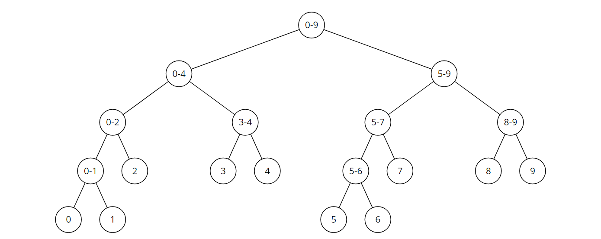

## #1 도입

**세그먼트 트리** : 자료들을 적절히 전처리해 구간에 대한 질의를 빠르게 처리하는 자료구조



* **시간복잡도** : 구간의 합을 $O(logN)$ , 원소의 변경을 $O(logN)$ 에 수행한다.  
  구간합을 구할 때 트리의 각 레벨에서 방문하는 노드는 4개를 넘지않는데,  
  [a,b] 의 구간합을 구할 때, 만약 같은 레벨의 l,m,r 노드를 방문했다면 m은 더이상  
  재귀호출을 하지 않는다. 이는 노드를 4개 방문할때도 동일하다.

두가지 연산 모두, 이진 검색트리와  비슷한 모양을 가지는 세그먼트 트리의 모양에 기초 한다.  
구간을 찾기위해 봐야 할 범위를 한 레벨 내려갈때 마다 거의 절반으로 줄여나가는 느낌을 기억하자.  

* **트리의 크기** : 트리의 리프노드의 개수는 최대 $2\times n$개 이다. 위 그림만 봐도 리프노드가 n개인데 무슨 말이냐고 하겠지만, 5와 6을 넣는 노드의 번호는 부모노드$\times$2 인점을 생각해보면 이해가 된다.  따라서 1+2+4+...+2n < 4*n 이므로 트리의 크기를 최악의 경우인  $4\times n$ 으로 잡는다

**[백준7578 공장]**<https://www.acmicpc.net/problem/7578>

B에서 i번을 볼때 이전에 본 것 중에서 i번의 A위치보다 더 앞에 있는 것의 개수를 센다  
이때 [i+1,n) 의 구간합을 구하는 작업, 그리고 i번의 A위치에 1을 올려주는 작업을 하는 적절한  
자료구조로 세그먼트트리를 이용한다.

**[백준2243 사탕상자]**<https://www.acmicpc.net/problem/2243>

들어있는 사탕 중 순위b인 사탕 꺼내기 , 맛 b인 사탕 c개 넣기, 빼기 2가지 연산이 필요하다.  
'**순위**' 에 의해 일단 상자에 넣어놓은 사탕이 **정렬**되어 있어야 함은 분명해 보인다.111224466  
정렬이 되어있고, 삽입 삭제가 빈번한 자료구조라...  
map 에서 k번째 수를 빠르게 찾는 방법이 생각나지 않으므로 세그트리를 떠올린다.

2번째 연산인 일반적인 update함수로 처리하고 첫번째연산이 관건인데  
세그먼트 트리도 이분 탐색 느낌으로 구성된 자료구조임을 기억하면, 한 레벨을 내려갈 때, k의 크기를  약 절반씩 줄일 수 있다는 것을 알 수 있다. 

```c++
    if(tree[node*2]>=k) return query(tree,node*2,st,(st+en)/2,k);  
    else {
        k -= tree[node*2];
        return query(tree,node*2+1,(st+en)/2+1,en,k);
    }
```

k번째 수를 찾는 DP와 비슷한 모습이다. 

**[백준11658 구간 합 구하기3]**<https://www.acmicpc.net/problem/11658>

2D segment tree

**[백준3653 영화수집]**<https://www.acmicpc.net/problem/3653>

위에있는 DVD개수 구하기 , 빼고 맨위에 넣기 2가지 연산이 필요하다.  
구간 질의를 통해 dvd개수를 구한다 라고하면 트리의 노드에는 존재여부 1 0 이 들어가야 할 것인데...

1. 내 위에있는 dvd는 어디부터 어디인가?

2. dvd개수는 위쪽은 늘어나기만 하고 아래쪽은 줄어들기만 한다.

2가지 고민을 토대로 생각해볼 수 있지만, 그냥 아이디어가 필요한 문제 같기도 하다.   
트리의 크기를 $4(m+n)$ 앞에 여유를 두고 잡아, 뺀 dvd를 바로 앞쪽부터 넣으면  
1번 고민에 대한 답이 해결된다.

<br>

## #2 Lazy Propagation

1개의 원소를 update하는 것이 아닌, ' $[i,j]$ 에 $v$ 를 더하라' 같은 쿼리를 $O(logN)$에 처리해보자!  
**아이디어** :  어떤 서브트리 아래에 전부 $v$ 를 더해야 한다면, 서브트리 루트에 $v$ 를 기록해놓고,   
		    나중에 아래쪽에 갈 일이 있을때 처리해주는 것이다.  
