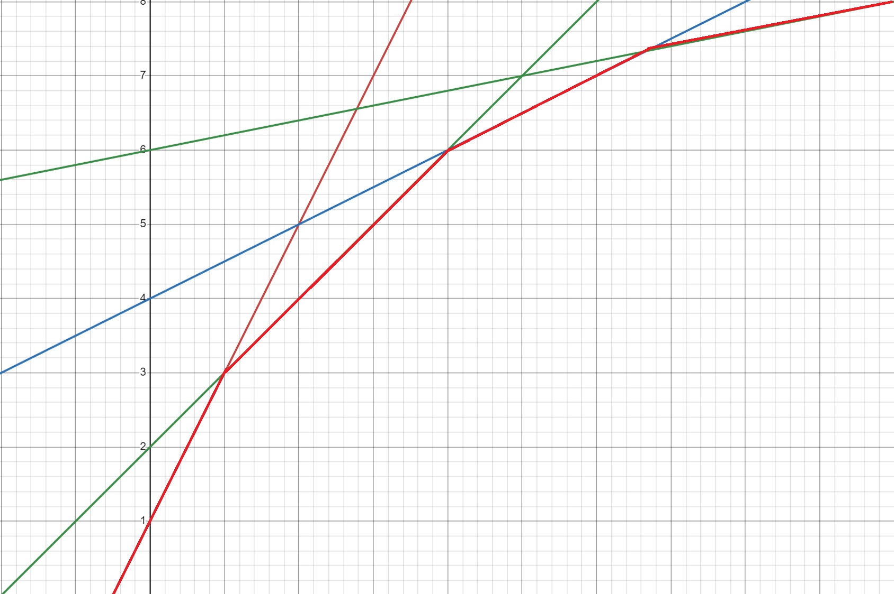

# **#4 전처리와 자료구조**

[kks227](https://blog.naver.com/kks227/221386454504)님의 블로그를 보고 공부며 정리한 내용이 많습니다.

**[백준10211 Maximum Subarray]**<https://www.acmicpc.net/problem/10211>{: target="_blank"}
기본적인 풀이로 psum을 계산해놓고 모든 부분합을 계산하는 $O(n^2)$ 의 풀이방법이 있다.

$dp[i]$를 $i$번째 숫자를 마지막 값으로 포함하는 부분합 중 최댓값 이라고 정의하면, 
$dp[i]$는 $psum[i]$ 에서 $psum[j]\,\,(0<=j<k)$ 중 가장 작은 값을 뺀 것과 같다.

$dp[i]$를 구할 때  필요한 $j$가  $i$보다 작기때문에, $dp[i]$를 구하고 나서
$LowSum = min(psum[j],psum[i])$ 를 미리 처리해주면 매번 반복문을 돌릴 필요 없이
$O(n)$ 에 계산할 수 있다.

**구간에 대한 최소값을 매번 구하지 않고, 이전 작업에서 전처리 하여 시간복잡도를 줄이는 예시**

<br>

**[백준14165 Team Building]**<https://www.acmicpc.net/problem/14165{: target="_blank"}>

일단 "각 팀에서 $k$명을 뽑는다'' 는 문장에서 1개 고르고  $k-1$을 호출하는 방식의 조합문제 풀이를 빠르게 떠올린다.

$dp[i][j][k]$ : $i$ 와 $j$ 사용한 이후 $[i+1,n],[j+1,m]$사용해서 $k$ 개 고르는 방법의 수
라고 하면 각 재귀함수마다 $O(nm)$ 개의 경우를 더해야 하므로 시간초과이다.
따라서 $i$, $j$ 이후의 숫자중에 $k-1$ 개 고르는 방법이 총 몇개인지 매번 구하지 말고
\***전처리** 해놓아야 한다.

$psum[i][j][k]$ 를 $i$, $j$ 에서 시작해 $k$개를 고르는 방법의 총합이라고 하면

```c++
dp[i][j][k] = psum[i+1][j+1][k-1]%mod;
```

$psum[i][j][k]$ 는 
(i,j)사용해 k개 만드는 경우 + i와 j중 i만 사용해 k개 + i와j중 j만 사용해 k + 둘다 사용안하고 k개
를 통해 구할 수 있다.

<br>

**[백준15678 연세워터파크]**<https://www.acmicpc.net/problem/15678>{: target="_blank"}

$1에서D$칸을 움직일 수 있기에, 출발점이 어디든 굳이 징검다리를 건너다가 방향을 바꿀 필요는 없다.
따라서 차례로 시작점을 옮겨가며 오른쪽으로 이동해봐야 겠다고 생각했다.

$dp[i]$ 가 $i$에서 출발한 최대 점수라고 하자 그렇다면 $dp[i] = a[i] + max(dp[j])\,\, for\,j = [i+1,i+D]$ 
이므로 매번 $D$ 번의 순회를 해야하므로 이것을 **\*전처리** 해놓아야 한다.

뒤에서 부터 시작을 해서 $dp[i]$ 를 구할 때  $[i+1,i+D]$ 에 해당하는 dp값을 내림차순map 에 value는 값의 개수로 넣어두고 최소값을 $O(logN)$ 에 $dp[i]$ 를 구하고 나면, 
$dp[i+D]$ 를 map에서 빼고 $dp[i]$를 넣는다.

***map** 자료구조를 활용해, 매번 $O(n)$ 이 아닌 $O(logN)$에 최댓값을 구하도록 하였다.*

**segment tree** 를 활용해도 비슷한 시간복잡도로 구할 수 있다.

또한 이 문제는 **monotone queue**라고 하는 최적화 기법을 사용해 $O(logN)$ 에 구할 수 있다.
새로운 값이 들어올때, 덱의 뒤에 넣는데, 자신보다 작은 값은 다 버리고 난 후에 인덱스정보를 넣는다.
$dp[i] = a[i] + max(dp[j])\,\, for\,j = [i+1,i+D]$  를 볼때 만약에 $i+1$ 값이 최댓값이면 나머지는  다시 볼일이 없다는 것을 이용하는 방식이다.

<br>

**[백준15908 복구]**<https://www.acmicpc.net/problem/15908>{: target="_blank"}

가능성의 최적값을 찾는 문제이며, 어떤 점을 기준으로 TF이 결정되는 문제임을 통해 **이분탐색**을 이용함을 알아낸다.

$mid$ 이하의 값만 지우며 데이터를 만들 수 있는지 판단을 해야하는데, 
$i$ 번째 값에 대해, 1. 지우고 $dp[i+1]$ 값 사용하기 2. $i$ 부터 시작하는 조각 만들기
2가지 Case에 대해 조사해야 함을 알 수 있다.

2번에 대해 고민해보면, $i$ 뒤에 $a[i]-1$ 개의 숫자가 와야하고, 지우기를 적절히 사용한다고 하면
$i+a[i]$ 부터  $b[i]>mid$인 값이 $a[i]-1$ 개 등장하는 곳 다음칸까지 중에서 $dp$ 값을 고를 수 있다.

1. 뒤에서 부터 순회하며, $b[i]>mid$ 인 인덱스를 **벡터**에 넣어 관리하여 어디부터 어디까지 조사가능인지 범위를 찾는다.
2. $mid$보다 작은 $dp$에는 1을 넣는다. 이를 이용해 조사하는 범위의 **세그트리** 쿼리값이 1보다 크다면   $dp[i]=1$ 이 가능하다.

가장 결정적인 아이디어는 조각만들기의 범위를 구할 때, 지울 수 없는 것들을 살펴봐야 한다는 것!

<br>

# #5 Convex Hull Trick

## (1) Convex Hull

**볼록 껍질** : 2차원 평면상에 여러개의 점이 존재할때, 몇개의 점을 이용해 만들 수 있는 모든 점을 포함하는 **볼록다각형**

**Graham's Scan** : 볼록 껍질을 추출하는 알고리즘

1. 기준점을 잡는다. 해당 점을 지나는 어떤 직선을 그었을 때, 모든 점이 한쪽에만 위치해 있어야 한다. 보통 x좌표가 가장 작거나 y좌표 가장 작은 점
2. 기준 점을 기준으로 다른 점들을 반시계 방향으로 정렬한다.
3. 스택에 0번과 1번점을 넣고 시작한다. 다음에 들어갈 점nxt가 스택의 제일 위의 점 2개가 만드는 벡터의 왼쪽에 있는지 확인하고 왼쪽에 있다면 nxt를 스택에 넣는다
4. 아니라면 nxt가 왼쪽에 있을때까지 스택의 크기가 2보다 작아지지 않도록 하며 반복한다.

```c++
#include <bits/stdc++.h>
#define fastio cin.tie(0); cout.tie(0); ios_base::sync_with_stdio(false);
using namespace std;
using ll = long long;

struct Point{
    int x,y;
    int p,q;
    Point(): Point(0,0,1,0){}
    Point(int x1,int y1): Point(x1,y1,1,0){}
    Point(int x1,int y1,int p1,int q1) : x(x1),y(y1),p(p1),q(q1){}

    bool operator <(const Point& O) {
        //외적값이 양수이면, CCW이면 operator< 가 참이되므로,
        //반시계방향으로 오름차순 정렬이 가능하다.
        if(1LL*q*O.p != 1LL*p*O.q) return 1LL*q*O.p < 1LL*p*O.q;
        if(y != O.y) return y < O.y;
        return x < O.x;
    }
};
ll CCW(const Point& A,const Point& B,const Point& C) {
    return 1LL*(B.x-A.x)*(C.y-A.y) - 1LL*(B.y-A.y)*(C.x-A.x);
} //양수면 ccw
int main(void) { 
    fastio
    
    int n; cin>>n;
    vector<Point> a(n);
    for(int i=0;i<n;i++) {
        cin>>a[i].x>>a[i].y;
    }
    sort(a.begin(),a.end());
    for(int i=1;i<n;i++) {
        a[i].p = a[i].x - a[0].x;
        a[i].q = a[i].y - a[0].y;
    }
    sort(a.begin()+1,a.end());

    stack<int> s;
    s.push(0); s.push(1);
    int nxt = 2;
    while(nxt<n) {
        while(s.size()>=2) {
            int first = s.top(); s.pop();
            int second = s.top(); 
            if(CCW(a[second],a[first],a[nxt])>0) {
                s.push(first);
                break;
            }
        }
        s.push(nxt++);
    }
    cout<<s.size();
}
```

곳곳에 있는 CCW아이디어를 까먹지 않게 여러번 구현해보자.

**[백준2254 감옥건설]**<https://www.acmicpc.net/problem/2254>{: target="_blank"}

1. $px$, $py$ 기준점으로 잡고 반시계 정렬 시도하면 안되는 **이유**
   기준점을 지나는 어떤 직선을 그었을 때 모든 점이 한쪽에 위치하도록 하는 직선이 존재하지 않는다면, 정렬관계 사이에 모순이 생겨 제대로 정렬이 되지 않는다.
2. 각 담벼락 마다 감옥이 안쪽에 있는지 확인하지 않고, 볼록껍질을 만들고 나서 확인해도 되는 **이유**
   Convex Hull은 점이 만들 수 있는 가장 큰 다각형이므로 가장 효울적이고 가능성이 높은 담장이다
   따라서 매 시도마다 컨벡스 헐을 만들고, 그 안에 감옥이 없다면 종료하는 것이 풀이가 된다.

<br>

## (2) Convex Hull Trick

$dp[i] = \underset{j<i}{min}(dp[j] + a[i]b[j])$  $(b[i] >= b[i+1])$ 

이런 점화식과 조건을 가질 때, $O(n^2)$ 의 풀이를 $O(nlogn)$ 으로 최적화 할 수 있는 기법이다.
$a[i] 를 \,\,x$라고 하면 $f(x) = \underset{j<i}{min}(b[j]x+dp[j])$ 의 일차함수라고 생각 할 수 있다.
dp값을 구할 때 마다 직선을 한 개씩 긋는다면, $dp[i]$를 구할 때 0~i-1번째 직선 중 a[i]에서 최소 값을 가지는 직선을 $O(logN)$ 에 찾을 수 있다면 우리의 목표를 달성할 수 있을 것 같다.



각 직선이 담당하는 최소값의 범위(그래프의 빨간 볼록 껍질)가 어디인지 알고 있고, 범위들이 정렬되어 저장되어 있다면, 이분탐색을 통해 직선을 $O(logN)$에 찾을 수 있다.

```c++
#include <bits/stdc++.h>
#define fastio cin.tie(0); cout.tie(0); ios_base::sync_with_stdio(false);
using namespace std;
using ll = long long;

struct Line{
    ll a,b; //y=ax+b
    double s; //왼쪽 교점
    Line(): Line(1,0){}
    Line(ll a1,ll b1): a(a1),b(b1),s(0) {}
};

double cross(Line& f,Line& g) { //교점
    return (g.b-f.b)/(f.a-g.a);
}

int main(void) { 
    fastio
    
    int n; cin>>n;
    vector<ll> a(n);
    vector<ll> b(n);
    for(int i=0;i<n;i++) cin>>a[i];
    for(int i=0;i<n;i++) cin>>b[i];

    vector<ll> dp(n);
    int top = 0; //벡터를 스택처럼 관리하기 위한 변수, 새로운 값이 들어올 인덱스
    vector<Line> f(n);
    for(int i=1;i<n;i++) {
        Line g(b[i-1],dp[i-1]);
        while(top>0) {
            g.s = cross(f[top-1],g); //각 선분의 왼쪽 교점을 저장
            if(f[top-1].s<g.s) break;
            top--;
        }
        f[top++] = g;

        ll x = a[i];
        int fpos = top-1;
        if(x<f[top-1].s) {
            int lo = 0; int hi = top-1;
            while(lo+1<hi) {
                int mid = (lo+hi)/2;
                (x < f[mid].s ? hi : lo) = mid;
            }
            fpos = lo;
        }
        dp[i] = f[fpos].a * x + f[fpos].b;
    }
    cout<<dp[n-1];
}
```

1. 새로운 선분과 스택의 맨위의 선분의 교점$p2$ 을 구한다. 

   * 만약 이 교점이 맨위 선분의 왼쪽 교점$p1$ 보다 더 왼쪽에 있다면 맨위 선분을 빼도 된다.
     → 선분의 기울기는 감소하기때문에 $p2$ 부터 새로 들어온 선분이 무조건 더 아래에 있기 때문에

   * 아니면 교점을 기록하고 스택에 넣는다.

2. 지금까지 들어온 선분을 이용해 $a[i]$ 가 속하는 선분을 구하고 값을 대입한다.
   왼쪽 교점을 저장했기 때문에 $a[i] < f[mid].s$ 일때 $mid$는 $false$ 이므로 $hi$에 넣는 것이다

<br>

* $a[i]<a[i+1]$ 즉 $a$배열이 증가하는 경우에 전에 사용한 선분보다 이전의 선분은 볼 필요가 없다

  따라서 이 경우에는 $O(n)$ 에 해결이 가능하다.

  ```c++
  for(int i=1;i<n;i++) {
      line g(b[i-1],dp[i-1]);
      while(top>0) {
          g.s = cross(f[top-1],g);
          if(f[top-1].s < g.s) break;
          if(fpos==top) fpos--;
          top--;
      }
      f[top++] = g;
      
      ll x = a[i];
      while(fpos+1<top && f[fpos+1].s < x) fpos++;
      //fpos선분에 x가 위치할 때 까지 fpos증가
      dp[i] = f[fpos].a*x+f[fpos].b;
  }
  ```

감소하는 배열의 원소가 점화식에 존재하며, $i$ 번째 점화식을 구할때 0~$i$-1 번째 값을 모두 봐야하는 경우, 점화식이 여러 일차식의 최소, 최대를 다루는 경우 **CHT**를 고려해보자.

<br>

  **[백준4008 특공대]**<https://www.acmicpc.net/problem/4008>{:target="_blank"}

$dp[i] = \underset{j<i}{max}(f(\underset{k=j+1}{\overset{i}\sum}x_k ) + dp[j])$  : $i$ 번째 까지 사용한 총합

$dp[i] = \underset{j<i}{max}(f(psum[i]-psum[j])  + dp[j])$  까지 직관적으로 구할 수 있는 점화식이다.

$O(n^2)$ 의 시간복잡도를 줄이고 싶다는 마음, 점화식을 간단하게 만들 수 있을까 하는 마음, $x$가 모두 양수니까 $psum$은 단조증가라는 사실을 기억하며  함수에 대입을 해보자 $psum[i] = I$

$f(psum[i]-psum[j]) = a(I-J)^2+b(I-J)+c = (-2aJ)I + f(I) + aJ^2-bJ$
$dp[i] = \underset{j<i}{max}((-2aJ)I + f(I) + aJ^2-bJ + dp[j])$

$I$ 와 $J$ 가 곱해져있는 꼴, 계속해서 증가하는 기울기와 $max$ , **CHT**를 사용할 때다. 
$f(I)$가 있어서 신경쓰였지만, $i$ 에만 관련이 있으므로 상관이 없다는 것을 알았다.

```c++
#include <bits/stdc++.h>
#define fastio cin.tie(0); cout.tie(0); ios_base::sync_with_stdio(false);
using namespace std;
using ll = long long;

struct line{
    ll a,b;
    double s;
    line(): line(1,0){}
    line(ll a1,ll b1): a(a1),b(b1),s(0){}
};

double cross(line& f,line& g) {
    return (g.b-f.b)/(f.a-g.a);
}

ll a,b,c;
ll func(ll x) {return a*x*x+b*x+c;}

int main(void) {
    int n; cin>>n;
    cin>>a>>b>>c;
    vector<ll> arr(n); vector<ll> psum(n);
    for(int i=0;i<n;i++) {
        cin>>arr[i];
        if(i==0) psum[i]=arr[i];
        else psum[i] = psum[i-1]+arr[i];
    }
    
    vector<ll> dp(n);
    vector<line> f(n);
    dp[0] = func(psum[0]);
    int top = 0;
    int fpos = 0; //이전에 들어간위치
    for(int i=1;i<n;i++) {
        line g(-2*a*psum[i-1],a*psum[i-1]*psum[i-1]-b*psum[i-1]+dp[i-1]);
        while(top>0) {
            g.s = cross(f[top-1],g);
            if(f[top-1].s<g.s) break;
            if(top==fpos) fpos--;
            top--;
        }
        f[top++] = g;
        
        ll x = psum[i];
        while(fpos+1<top && f[fpos+1].s < x) fpos++;
        dp[i] = f[fpos].a * x + f[fpos].b + func(psum[i]);
        dp[i] = max(dp[i],func(dp[i])); //모두 한꺼번에 특공대 배치하는 경우
    }
    cout<<dp[n-1];
}
```

* **double 형변환 오류**
  어째서인지 이분탐색 풀이는 오류가 계속 났는데, $cross$함수에서 원인을 찾았다.

  ```c++
  double cross(line& f,line& g) {
      return (g.b-f.b)/(f.a-g.a);
  }
  ```

  리턴값은 double인데 계산식은 전부 정수형이라서 만약 2/4 같은 계산을 하면 리턴으로 0.5가 아닌 0이 나오게되는 것이다. 따라서 형변환을 해주고 계산을 했더니 AC를 맞았다.
  ```c++
  double cross(line& f,line& g) {
      return double(g.b-f.b)/(f.a-g.a);
  }
  ```

<br>

**[백준6171 땅따먹기]**<https://www.acmicpc.net/problem/6171>{:target="_blank"}

$dp[i] = \underset{j<i}{min}\,(h[j+1]w[i] +dp[j])$  : $i$ 까지 땅을 사는 비용

* $h$ 가 단조감소일때 CHT를 적용할 수 있겠다.  → 정렬
* 자신의 w,h보다 둘다 큰 땅이 존재하면, 큰땅 살때 같이사면 꽁짜니깐 지워버린다.
* 2번 관찰통해 w기준 오름차순이면  동시에 h기준 내림차순이다 따라서 $O(n)$ 최적화 구현

