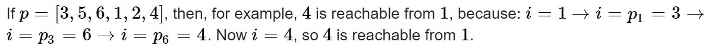
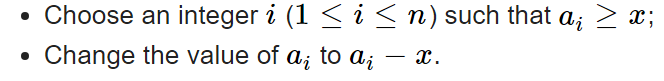

# #1 도입

방학동안 약10번 가량의 Contest를 참가했는데 제대로 upsolving을 한적이 없다는 사실을  학교가는 길에 깨달았다. 소잃고 외양간을 고쳐보자

# codeforces Round 969 (Div. 2)

## D. Iris and Game on the Tree

1. 어떤 문자열 110101111000 이 있을때, 이전과 같은 숫자는 의미가 없기에 101010 으로 생각한다
2. 101010에서  101과 같이 1에서0을갔다가 다시1로오면 상쇄되므로 101이나 010 1과 0으로 봐도 된다. 
3. 문자열을 치환하다보면 맨앞과 맨뒤가 다르면 합산 1or-1 , 맨앞맨뒤가 같으면 합산0 임을 알 수 있다.
4. 즉 루트와 리프에 어떤값이 들어가는지가 score를 결정한다.

**배운점**

1. 함수 인자로 벡터나 배열을 전달할 때에는 참조자를 붙이는 것을 까먹지 말자.

2. **루트**와 **리프**는 트리에서 자신을 제외한 **1가지의 노드**에게만 연결된다. 따라서 

   ```c++
   if(adj[i].size()==1)
   ```

   과 같이 간단한 코드로 리프인지를 판단할 수 있다.

3. 랭커들의 코드를 보고 **게임 이론**을 구현하는 스타일에 대해 공부해보았다

   ```c++
   while(root==2 || cnt[2]>0) {
               if(it==0) {//첫번째 플레이어
                   if(root==2) {
                       if(cnt[0]==cnt[1] && skip%2==1) {
                           //player1 차례에 skip이 홀수개이고 리프의 0과1 개수같다면 상대가 선택할
                           //때까지 skip을 고르는게 이득이므로 skip을 선택한다
                           //짝수일때는 서로 의미가 없으므로 바로0으로 만들어도 상관이 없다.
                           skip=0;
                       }
                       else {
                           root = (cnt[0]>cnt[1] ? 1 : 0);
                       }
                   }
                   else {
                       //root와 반대되는 숫자를 리프에 넣어준다
                       cnt[2] -= 1;
                       cnt[root ^ 1]++;
                   }
               }
               else {
                   if(root ==2) {
                       root = (cnt[0]>cnt[1] ? 1:0);
                   }
                   else {
                       //player2는 root와 같은 숫자를 리프에 넣는다
                       cnt[2]--;
                       cnt[root]++;
                   }
               }
               //다음순서로 바꾸어준다
               it ^=1;
           }
   ```

   * 삼항연산자로 코드를 간단히 하는 습관을 들이자
   * a^1 은 짝수면 1을 더하고 홀수면 1을뺀다 이를 이용해 0과1을 번갈아 이동할 수 있다.

## E. Iris and the Tree

1. 트리가 dfs order를 가지기 때문에, 연속한 노드 사이거리 합은 모든 간선을 오직 **2번씩** 더한 값이다. (내려갈때 올라갈때)

2.  $i$→ $p_i$  가중치를 사용하는 경우는 $(i-1)$→ $i$  과   $i$ 의 subtree 에서 가장 큰값에서 다음으로 이동하는 두가지 경우뿐이다. 
3. 노드 사이거리 합을 구하는 각 step에서 결정되지 않은 간선은 $w$를 지키는 선에서 마음대로 정할 수 있으니, 아무 간선도 주어지지 않은 상태에서 최대값은 $n*w$ 이다.
4. (2)에 의해 가중치가 주어지면,  $(i-1)$→ $i$ 의 값은 고정이 된다.   
   그러나 $i+s_i−1$ → $i+s_i$   의 경우 경로에 간선이 여러개 존재 할 수 있으므로, cnt배열을 관리하여 $cnt[i+s_i-1]==0$ 이 되는 경우에 고정이 되는 것으로 한다.

<br>

**DFS구현 방식과 최댓값 계산식은 코드를 보며 이야기 해보자**

```c++
int cur = 0;
vector<vector<int>> f(n); //f[i] : i→pi 간선을 사용하는 2가지 출발 노드 저장
vector<int> cnt(n); //cnt[i] : i→i+1 가는 길에 존재하는 간선 개수

void dfs(int v) {
    cur++;
    for(auto nxt : adj[v]) { //nxt는 v의 자식노드
        f[nxt].push_back(cur-1);
        cnt[cur-1]++;
        dfs(nxt);
        f[nxt].push_back(cur-1);
        cnt[cur-1]++;
    }
}
```

트리를 순회하면서, $i$→ $p_i$가중치가 영향을 미치는 출발지가 어디인지 알아내야 하고, 
각 노드사이에 몇개의 간선이 있는지 알아내야 한다.

* 리프가 아니라면 f[i]에 i-1을 넣고 i의 자식을 dfs에 넣고 호출한다.
* 리프에 도달하면 $i+s_i-1$ 과 $i+s_i$ 의 LCA까지 cnt[i+s_i-1]을 증가시킨다.

<br>

```c++
ll sum = 0;
        int tot = n; 
        for(int i=1;i<n;i++) {
            ll x,y; cin>>x>>y; x--;
            for(auto k : f[x]) {
                cnt[k]--;
                if(cnt[k]==0) tot--;
            }
            sum +=y; 
            cout<<tot*w + sum *(2-tot)<<' ';
        }
```

* y의 길이는 2가지 경로에서만 사용되고, 나머지 미확정 경로에서는 y만큼 전부 감소해야 한다.

<br>

# Codeforces Round 970 (Div. 3)

## D. Sakusrako's Hobby



→ reachable 한 숫자들은 사이클을 이룬다 : 각 숫자가 한 번씩만 등장하기 때문에 사이클 외에 모양은 존재하지 않는다.

→ 사이클은 같은 score을 가지므로 사이클에 해당하는 숫자를 전부 찾고 나서 값을 넣어준다.

## E. Alternating String

1. 문자열에서 하나를 지우면 **그뒤의 문자들**의 인덱스가 1씩 감소한다 → **짝홀이 바뀐다**
2. $i$ 까지 어떤 문자의 개수를 미리 구해놓아서 시간을 줄인다 → Prefix sum 이용하는 DP

## F. Sakurako's Box

두 개를 선택해 곱한 값의 기댓값을 $P\over Q$ 로 나타낼 때 $P*Q^{-1}(mod\,10^9+7)$ 를 구하시오. 
분수에 모듈로 연산이라...

### \*모듈러 연산 특강

* 모듈러 연산은 더하기, 뺄셈, 곱셉에 대해 성립한다.

* 모듈러 곱셈의 역원 ($a,b$는 정수)

  $a(mod\,\,N)$ 의 모듈러 곱셈의 역원은 $ax≡ 1(mod\,\,N)$ 를 만족하는 $x$ 이다
  $ax = kN+1$ 이고 $ax-kN=1$ 으로 나타내며 이는  $aN+bM$ 꼴임을 알 수 있다.

  * **베주 항등식** : $ax+by = gcd(a,b)$ 를 만족하는 0이 아닌 정수 $x,y$ 가 항상 존재한다.

    1. $S=\{m∣m=ax+by>0,x∈Z,y∈Z\}$ 에서 $x=a,\,y=b$ 가 가능하므로 $S$는 공집합이 아니며 자연수의 부분집합이다.  자연수의 정렬성에 의해 S는 최소값 $d$를 가진다.
    2. $d = ak+bl$ 라고 하자,
       어떤 $x = au+bv$ 가 $S$에 속하는데 $d$의 배수가 아니라면 $x = qd+r(0<r<d)$ 인데,
       $r=x−qd=(au+bv)−q(ak+bl)=au−aqk+bv−bql=a(u−qk)+b(v−ql)∈S$ 즉 $r$은 $d$보다 작아야 하는데 $S$ 에 속하므로 모순, 따라서 모든 $S$의 원소는 $d$ 의배수 이다.
       $|a|,|b|$ 가 $S$에 속하기 때문에 $d$ 는 $a,b$ 의 공약수이다.
    3. 어떤 수 $e$ 가 $a,b$ 의 공약수 이면 $d = ak+bl = e(a'k+b'l)$ 이므로 $e$는 $d$의 약수이다.
       따라서 $d = gcd(a,b)$ 이다 

    **즉, $x,y$ 가 정수일 때, $ax+by$ 로 가능한 값은 $gcd(a,b)$ 의 배수이다**

    **즉, $x,y$ 가 정수일 때, $ax (mod\,\,b)$ 로 가능한 값은  $gcd(a,b)$ 의 배수이다**

    <br>

  $ax-kN=1$ 이 말하는 것은 1이 $gcd(a,N)$ 의 배수이어야 하므로 $gcd(a,N) = 1$
  **즉 서로소일 때만 $a$의 $N$에 대한 모듈러 곱셈의 역원이 존재한다.**

  <br>

  * **유클리드 호제법** : $a$를 $b$로 나눈 나머지를 $r$이라고 하면 $gcd(a,b)=gcd(b,r)$ 이다

    $a = bq+r$ 일때, $g = gcd(a,b)$ 라고 하면 $g|a,g|b$, $r = bq-a$이므로 $g|r$ 
    $g = gcd(b,r)$ 이라고 하면, $g|b,g|r$, $a = bq+r$ 이므로 $g|a$ 
    따라서 위 방법을 계속해서 진행하면 $(g,0)$의 형태가 나오게 된다. $O(logN)$  

    ```c++
    int gcd(int a,int b) {
        return b? gcd(b,a%b) : a;
    }
    ```

  * **확장 유클리드 호제법** : $ax+by=d=gcd(a,b)$ 를 만족하는 $(x,y)$ 를 구할 수 있다.

    1. $a=bq_0+r_1$ 을 $ax+by=d$ 에 대입하면 $b(q_0x+y)+r_1(x)=d$ 
       즉, $(a,b)$ 에 대한 문제를 $(b,r)$ 에 대한 식으로 줄인 것이다.
    2. 계속해서 범위를 줄이면 $(d,0)$ 까지 줄어들고 이때 $x_i=1,y_i=0$ 이 성립한다.
    3.  이 값을 가지고 재귀적으로 점점 더 큰 범위로 올라간다면 진짜 $x,y$ 를 알 수 있지 않을까?

    $a$의 계수를 $s$ , $b$의 계수를 $t$라 하고 1번 문장과  $ t_0=s_1-q_0s_0$ , $s_0=t_1 $ 을 보면 재귀적으로 $x,y$ 를 구할 수 있게 된다.

    ```c++
    ll exEuclid(ll a,ll b,ll& s,ll& t) { //gcd를 리턴하고 s,t를 갱신하는 함수
      if(b==0) {s=1; t=0; return a;}
      
      ll gcd = exEuclid(b,a%b,s,t);
      ll tmp = t;
      t = s-(a/b)*t;
      s = tmp;
      
      if(s<=0) {//역원이 양수가 되도록
        s+=b;
        t-=a;
      }
      return gcd;
    }
    ```

    <br>

    **식으로 한 번 살펴보자**

    $a = r_1, b= r_2$

    $a=bq_0+r_2$
    $b= r_2q_1 + r_3$
    $...$
    $r_{i−1}=r_iq_i+r_{i+1}$

    $r_{i+1} = 0$ 일 때 알고리즘이 종료되고 $r_i = d = gcd(a,b)$

    $r_i = s_ia+t_ib$ 를 $r_{i+1} = r_{i-1}-r_iq_i$ 에 대입하면
    $s_{i+1}a + t_{i+1}b = (s_{i-1}-s_iq_i)a + (t_{i-1}-t_iq_i)b$ 

  <br>

  * **모듈러 연산에서 곱셈의 역원**

    $ax\equiv 1(mod\,\,n)$ 인 $x$를 찾아라 → $ax+ny=1$ 만족하는 $x$ 찾아라 
    → $1=gcd(a,n)$ 일때만 $(x,y)$ 존재 → $a,n$ 서로소 일때만 역원 존재

    ```c++
    exEuclid(a,n,s,t); // s가 역원이 된다
    ```

    * 이렇게 구한 곱셈의 $x$ 는 유일한가요??
      $x1,x2$ 가 곱셈의 역원이라고 하면,  $n|(ax_1-1)$ , $n|(ax_2-1)$ 이므로 $n|(a(x_1-x_2))$
      $a,n$ 서로소 이므로, $n|(x_1-x_2)$  이므로 $x_1\equiv x_2 (mod\,\,n)$ 

<br>

**문제로 돌아와서**
$P$는 숫자 중 2개를 골라서 곱한 값들의 합 $Q$ 는 $_nC_2$  이므로 presum 값을 잘이용해 구한 후 
$P(mod\,10^9+7) * Q^{-1}(mod\,10^9+7)$  Q의 모듈러 곱셈역원을 구하면 된다.

* $mod$ 값이 소수라면 페르마의 소정리를 사용할 수 있다.
  이 포스팅을 끝내고 정수론 모음집을 하나 작성해야겠다.

<b>

## G. Sakurako's Task

 **choose** $a_i≥a_j$ **and assign** $a_i = a_i-a_j \;\;or\;\; a_i = a_i+a_j$ 

$a_1,a_2$ 에 위 작업을 계속해서 작은 수를 만들면 $g=gcd(a_1,a_2)$ 와 $0$ 을 얻게된다.
$a$ 의 개수가 늘어나도 이는 동일한데, 이말은 배열의 최소 간격이 $gcd$ 라는 것이다.

```c++
for(int i=1;i<n;i++) {
	mn = gcd(mn,a[i]);
}
for(int i=0;i<n;i++) a[i] = mn*i;
```

배열을 처리한 후 이분탐색으로 $mex_k$ 를 찾을 수 있다.

<br>

## H. Sakurako's Test



median을 최소화 → 어떤 $x$ 가 주어지면 모든 $a_i = a_i\%x$ 하고 median 구하는게 최적이겠다.
$n,q$ 가 모두 10만이라 각 쿼리마다 선형시간 보다 짧은 방법을 찾아서 풀어야 한다.

"$m$ 이 median이 될 수 있다 <=> $a_i\leq m$인 $a_i$가 $n\over2$개 이상이어야 한다"를 떠올리며 문제를 읽어보자
$(1≤a_i≤n)$ 이라는 크리티컬한 조건이 주어져 있는 것을 보고 낌새를 채야한다.

$a_i (mod\,\,x) \leq m$ 개수를 세기 위해서는 가능한 모든 k에 대한 $[kx,kx+m]$ 개수를 세면 된다.
$psum$ 을 이용하면 개수세는 것은 $O(1)* {n\over x}$ 의 시간복잡도를 요구한다는 것을 알 수 있다.
$x$는 10만 이고 x가 1부터 n까지 $n\over x$ 을 더하는 시간복잡도는 $nlog(n)$ 이라고 한다. 

따라서 이분탐색의 시간복잡도 까지 고려하면 $nlog^2(n)$ 의 시간복잡도에 해결 할 수 있다.

* $x$ 로 1이 계속 들어오는 경우가 있기 때문에, 미리 1~n 까지 계산해 놔야 시간초과가 나지 않는다!!
