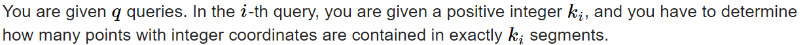
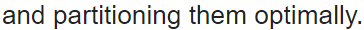
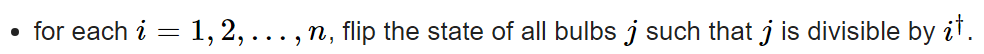
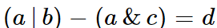
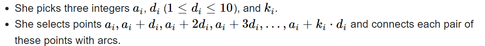

# #1 도입

...

# Codeforces Round 975 (Div. 2)

반드시 나중에 다시 풀어보자, 자력솔 하지못한게 많고 좋은 관찰이 필요한 세트라고 생각됨..

## B. All Pairs Segments



$k_i\,segments$ : $k_i$개의 구간
$k_i\,th\,\, segments$ : $k_i$번째 구간

1. 어떤 숫자가 포함되는 구간의 숫자는 자신의 왼쪽 개수와 오른쪽 개수의 곱
2. 수열에 등장하는 숫자는 (왼쪽+1)*(오른쪽+1) - 1 개의 구간에 속한다.

<br>

* **반성**

  어떤 값이 몇개의 구간에 속하는 지 어떻게 구할까 → 4가 속하는 구간을 전부 살펴볼까?
  → 구간의 l,r 이 4의 왼쪽과 오른쪽 에 있구나 
  와 같이 숫자로 끼워 맞추기 보다는 질문을 더 간단한 문제로 바꾸어 "관찰" 을 하기위해 노력하자

<br>

## C. Cards Partition

$1$~$n$ 카드의 개수가 주어지고, $k$개의 카드를 종류 상관없이 추가할 수 있다.
모든 카드를 같은 사이즈의 덱에 나눌 때, 덱의 가능한 최대 사이즈를 구하라

  → 덱에 공간이 남고 이딴 상상은 하지말라는 거다

1. 덱의 길이로 가능한 값은 어떤 특징을 가질까? (**관찰해보자**)
   길이 1 :  하나씩 넣으면 되니까 ok
   길이 2 : 겹치지 않게 두개씩 넣어야 되니까 최대개수$mx$ 가 $(sum+k)\over 2$ 보다 작거나 같긴 해야겠고 남으면 안되니깐 총 카드 개수는 짝수여야 겠네
2. 덱의 길이가 $x$ 라면 **(일반화 해보자)**
   $mx \leq {(sum+k)\over x}$ 이고 , $(sum+k)\%x == 0$ 
3. 덱의 길이는 최대 $n$ , $[sum,sum+k]$ 에 $x$ 로 나누어 지는 수가 존재하는지 확인하는 것은 $O(1)$
   이므로 $O(n)$ 에 정답을 찾을 수 있다!

<br>

## D. Speedbreaker

$x$ 이하의 숫자들을 전부 포함하는 $[L,R]$ 의 길이가 $x$ 보다 크다면 가능한 답은 없다

$x$ 이하 숫자 전부포함 범위가 $[L,R]$ 일 때, 출발점으로 가능한 범위는 $[R-x,L+x]$
$(0\leq x \leq n-1)$ 의 모든 값에 대해 출발점으로 가능한 좌표의  개수가 정답이다

$\{5,5,0,2,2,4\}$ , $x=2$ 일때를 살펴보면 $L=2,R=4$    $R-x=2,L+x=4$ 이므로 $[2,4]$
아니 무조건 0부터 시작해야 하잖아요!
→ $x=2$ 를 살펴본다는 것은 배열의 모든 2에 대해 제시간에 도착 할 수 있는 점을 찾는다는 것이고, 
정답은 이전에 $x=0,1$ 에 대해서 구한 범위도 모두 포함되는 점을 찾는 것이기에 오류가 아니다! 

<br>

1. 접근 방식
   첫번째 줄의 관찰을 하기 위해 필요한 질문은 아마도 " 어떤 조건에서 답이 안 될까? " 일 것이다
   문제를 처음보고 " 답이 되기 위해 어떤 조건이 필요한가? " 질문과 동시에
   불가능한 답의 후보를 제외시키는 방법도 고려하면서 관찰을 진행하자

2. 구간에 값을 더하는 재미있는 방식

   ```c++
   for(int i=0;i<n;i++) {
       ...
       int l = max(0,R-i);
       int r = min(n-1,L+i);
       f[l]++;
       if(r<n-1) f[r+1]--;
   }
   
   for(int i=1;i<n;i++) f[i] += f[i-1];
   ```

   새로운 $[l,r]$ 에 1씩 더하는 작업을 하고 싶다. 하지만 차례로 하나씩 더하면 $O(n)$ 이다.
   위 코드처럼 시작점에 1을 더하고 끝나는 점 오른쪽에는 $1$을  빼고, 위 반복문을 돌리면 원하는 구간에만 $+1$ 효과를 주고 뒤에는 상쇄시키는 방식으로 시간을 줄일 수 있다.

<br>

## E. Tree Pruning

리프노드를 제거할 수 있을때, 모든 리프가 같은 깊이 이기 위한 최소 제거 횟수는?

"리프노드 깊이$x$ 일때 어떤 것을 잘라야 할까?" <=> " 리프노드 깊이$x$ 일때 어떤 것이 남아있을까? "

1. 왼쪽 질문이 직관적이므로 먼저 답해보자
   일단 $x$ 보다 더 깊은 것은 무조건 잘라야 하고, 리프가 $x$ 보다 작은 노드들은 자르긴 해야 하는데 어디까지 자르나면... 음... $x$ 까지 가는 길이 있으면 거기까지 자르고 아니면....

   $x$ 일때 짧은 애들은 무조건 잘라야 되긴 하는데 어디까지 자르냐에서 막혔네..

2. 동일하게더 깊은 노드는 필요없고, $depth = x$ 인 노드에서 루트로 향하는 길은 전부 남아있겠네하나씩 올라가 보기엔 시간이 부족하고... 루트로 향하는 길에 있는 노드들의 특징은 뭐가있지?

3. 특징1. 모두 depth가 $x$ 보다 작거나 같다.
   특징2. 그 점에서 갈 수 있는 최대 깊이가 $x$보다 크거나 같다.

4. $i$노드의 깊이 : $a_i$ , 갈수있는 최대 깊이 : $b_i$ 이면 $i$ 노드는 $x = [a_i,b_i]$ 일 때 남아있다. 따라서 구간이 가장 많이 겹치는 $x$가 리프깊이 일때 가장 많은 노드가 남아있다 $=$ 최소로 자를 수 있다

<br>

# Codeforces Round 976 (Div. 2)

## A. Find Minimum Operations

$(n-k^x)$을  $x\geq0$ 조건 아래 반복할 때, $n$을 0으로 만들기 위해 최소 몇번 해야 하는가?

숫자 $n$ 을 이진수로 바꾸는 문제를 떠올려보자
n을 0이 될때까지 2로나누고 나머지가1이면 1을 문자열에 추가하고 0이면 0을추가한 후
문자열을 뒤집었다. 혹은 큰 수의 비트부터 같은 방식으로 진행했다.

$k^x$를  $k진수$의 $x$번째 자리라고 생각하면, 
$n$이 0이 될때까지 $k$로 나누고, $n\%k$는 $k진수의\,\,x번째 자리수$ 라고 볼 수 있다.

```c++
if(k==1) {cout<<n<<'\n'; continue;}

while(n>0) {
    ans += n%k;
    n /=k;
}
```

* **Intuition Training**
  * $k^x = k진수의\,\,x번째\,\,자리$
  * $정수\,n을\,\,정수\,k의 \,\,제곱수들의\,\,합으로\,\,나타낼\,\,수\,\,있다 = k진수$
  * $n\%k = n<k가\,\,될때\,\,까지\,\,k를\,\,뺀\,값$

<br>

## B. Brightness Begins



$n$까지 위 작업을 했을 때, 켜진 전구가 $k$개가 되는 $n$의 최솟값을 구하라

$n$ 개의 전구가 있을때, 끝나고 켜져있는 개수 : $n-(n이하의\,제곱수\,\,개수)$

$y = sqrt(n)$ : $n$이 정수라면 소수를 버리므로 $n-(n이하의\,제곱수\,\,개수) = n-sqrt(n)$
이분탐색으로 $n$을 찾으면 된다.

* **Intuition  Training**
  이분탐색 $FFFFFTTTTTTT$  → 최소값 찾기 문제, $ans = hi$
  이분탐색 $TTTTTFFFFFFF$  → 최대값 찾기 문제, $ans = lo$

<br>

## C. Bitwise Balancing

 만족하는 $a$를 찾기

$b,c,d$의 각 bit의 값에 따라 $a$값이 결정 되므로, $b,c,d$의 비트값을 추출해서 비교하는 것이 좋다.

$or$ 연산에서 $and$ 연산을 빼기 때문에 0에서 1을 빼서 내림하거나 올림하는 경우는 없다.

$a$의 $i$번째 비트로 가능한 값은 0아니면 1이다.

* **Intuition Training**
  * 정수$a$의 이진수 비트를 추출하고 싶어 → $int\,\,aa = (a>>i)\&1 \,\,\,(for\,\, i=0,1,..)$
  * $(1<<i)$ 비트 연산을 할때, int 범위 넘어가면 무조건 $(1LL<<i)$ LL까먹지마

<br>

## D. Connects the Dots



* 풀이1

  같은 $d$를 가지는 집합들을 아래처럼 어떤 구간에 "표시" 하면,

  ```c++
  for () {
      int l = a; int r = a[i]+k[i]*d;
      f[l]++;
      f[r]--;
  }
  for(int i=d;i<n;i++) f[i] += f[i-d];
  ```

  $f[i]>0$ 이면 $f[i]$와 $f[i+d]$를 연결해야 한다는 것을 알 수 있다. $DSU$ 를 사용해 $merge$하는데,서로 다른 집합이 합쳐질때마다, 모든 집합의 개수는 하나씩 감소하는 것을 이용해 답을 구한다.

* **Intuition Training**
  * $DSU$에서 서로 다른집합이 $merge$ → 총 집합의 개수 1개 감소

<br>
