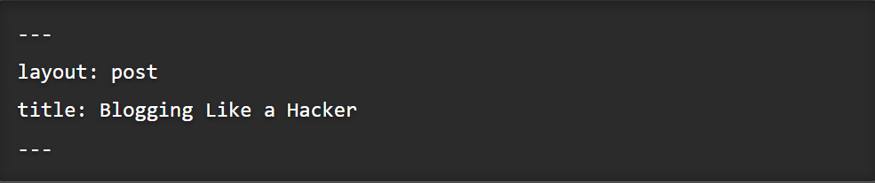

## #1 XML, JSON, YAML 이 뭘까

https://www.youtube.com/watch?v=55FrHTNjTCc 영상을 참고해서 공부했다.

1. 컴퓨터는 쭉 이어지는 문자열을 통해 서로 파일을 주고 받는다.
2. 구조화된 정보를 주고받기 위해 합의된 형식중 널리 사용되는것이 xml, json
3. xml 은 태그를, json 은 colon과 브라켓등을 이용해 구조화 -> 줄바꿈이나 띄어쓰기 는 상관X
4. YAML 은 파이썬 처럼 줄바꿈과 탭이 이용

Jekyll 블로그는 YAML 머리말 블록을 가진 **모든** 파일을 특별한 파일로 인식 하여 처리한다  

| 변수                  | 설명                                                         |
| --------------------- | ------------------------------------------------------------ |
| layout                |                                                              |
| permalink             |                                                              |
| category , categories | post를 폴더 안에 넣는 대신 카테고리를 지정한다.              |
| tags                  | 여러 태그를 포스트에 추가할 수 있다.   카테고리와 더불어 여러 개를 입력시 YAML목록 형식으로 입력 |

→ 매번 포스트를 작성 할 때마다 Front Matter를 작성해주어야 할까? 

## #2 경로에 관하여

1. 절대경로 : 파일의 root부터 파일까지의 전체 경로  
   → 어느 곳에서든 경로에 접근 할 수 있지만 , 경로가 변경되면 일일히 수정해야하는 단점

2.  상대경로: 현재 파일의 위치를 기준으로 연결하는 파일이 어디있는가
   /  : root   |  ./ : 현재위치  | ../ 상위경로(부모폴더)

## #3 레이아웃

레이아웃 : 컨텐츠를 포장하는 템플릿 → 모든 페이지에 네비게이션이나 푸터를 매번 입력할 필요가 없다.  
_layouts 폴더에 여러 레이아웃이 존재하며,  default.html 기본 템플릿을 상속해서 다른 레이아웃을 만든다.

## #4 디렉토리 구조

